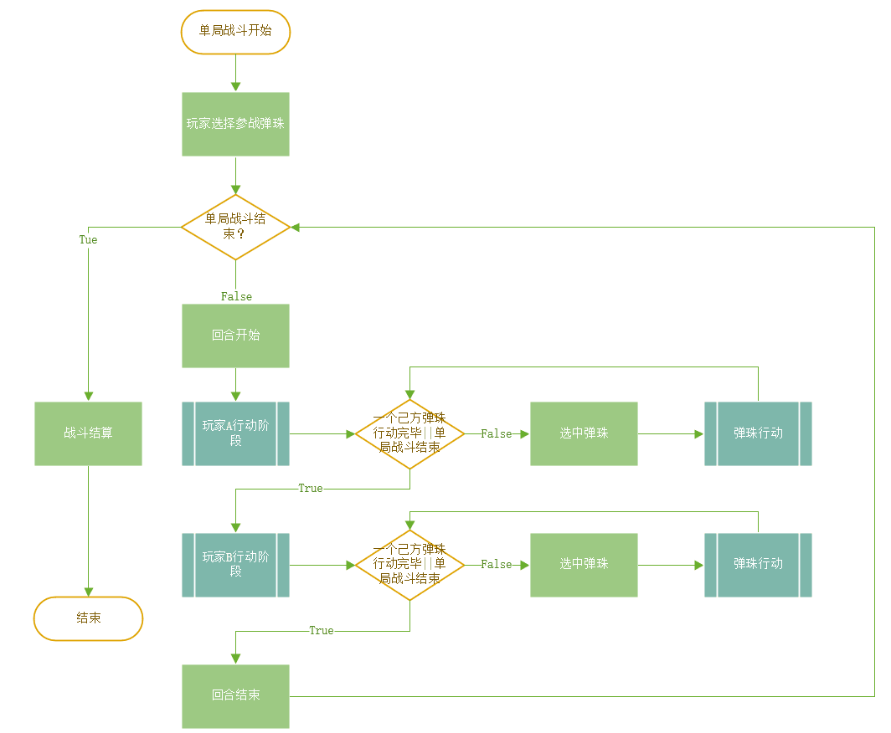
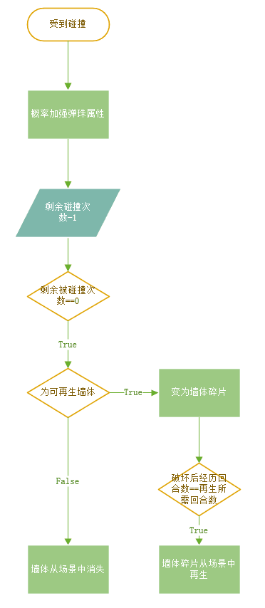
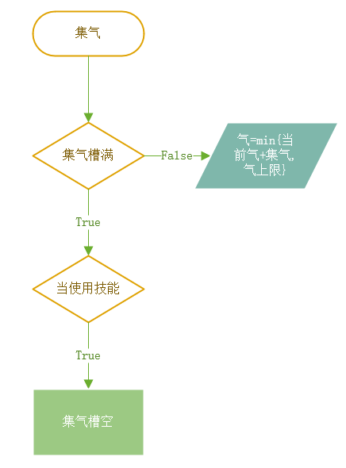

# 战斗系统

[TOC]

## 名词说明

### 弹珠

玩家操作的单个角色。

### 弹珠销毁

单个弹珠血量归零，从场景中消失。

### 弹珠行动

选中单个弹珠后的发射或是消耗集气槽的强化发射的操作。

### 行动阶段

从单个玩家获得操作权限开始，到该玩家执行弹珠行动为止。

### 弹珠动画

行动阶段后，从被发射的弹珠开始运动，到场景内所有物体静止。

### 回合

玩家A、B依次完成行动阶段和各自的弹珠动画播放。

### 单局战斗

从两位玩家进入战斗开始，到单局战斗结束为止。

### 单局战斗结束

一方所有[弹珠销毁](#弹珠销毁)||玩家主动退出游戏==true

### 气

弹珠通过规则内的行为获得的数值之一，积累的气用于释放弹珠的强化发射。

### 集气

玩家通过可获得碰撞和弹珠效果收集气。

### 集气槽

显示单个玩家气的总积累量的UI图像，单个玩家的所有弹珠共用一个集气槽。

气为0时，集气槽空，集气达到上限时，集气槽满。

集气槽被划分为三格。消耗一格集气槽可以用于释放一次强化发射。

### 墙体

场景内除角色和地面平面以外的所有可碰撞物体，均不可移动，会与弹珠之间产生物理碰撞。

### 可破坏墙体

可以被弹珠碰撞破坏的墙体，具有耐久度，每被碰撞一次耐久度 - 1，当耐久度为0时，墙体被破坏销毁。

### BUFF

指生命值上限加成，初始最大速度加成和攻击力加成。其中速度与攻击力加成最多只有3层，超出将溢出无效。

### DEBUFF

指初始最大速度降低和攻击力降低，最多只能有3层，超出将溢出无效。相同类别的BUFF与DEBUFF之间每层可以相互抵消。

### 可再生墙体

一些可破坏墙体被销毁后，从被破坏销毁后开始计算，经过固定的弹珠行动数后，在原位置重新再生。

### 不可破坏墙体

不可以被任何行为破坏的墙体。

---
## 系统概述

双人回合战斗。弹珠与弹珠、弹珠与场景间，存在符合动量守恒和能量守恒的碰撞。弹珠运动过程中受到阻力，速度衰减，最终将停下，在受到下次操作或撞击前，弹珠将停留在该位置。

玩家需要通过发射弹珠、碰撞敌方弹珠，从而对敌方弹珠造成伤害。当敌方所有弹珠销毁，则游戏胜利。

###### 战前准备阶段：

两位玩家分别选择三颗弹珠，在限定的出生范围内摆放弹珠，然后进入战斗。战斗开始时，场景内总共有六颗弹珠。

###### 战斗中间阶段：

在操作回合内，玩家通过拖动操作，可以将弹珠弹向与拖动方向相反的方向。如碰撞到敌方弹珠，则对该敌方弹珠造成伤害。弹珠还可以通过碰撞和其他机制进行集气，消耗集气用于强化发射。

###### 战斗结束阶段：

一方所有弹珠销毁，或者单局时间结束。

---
## 规则逻辑

#### 单局战斗流程图

点击跳转名词定义：[弹珠行动](#弹珠行动)，[弹珠行动完毕](#弹珠行动完毕)，[单局战斗结束](#单局战斗结束)

**每一个回合，依次进入双方的行动阶段，每一行动阶段包含对己方某一个弹珠的操作，操作结束后将播放弹珠动画并及时结算结果，结算完成后进入敌方行动阶段**

#### 碰撞物理规则

无特殊效果时，弹珠与弹珠、弹珠与场景间，存在符合动量守恒和能量守恒的碰撞。

有技能等特殊效果时，特殊效果优先级大于物理碰撞。

##### 可破坏墙体碰撞规则

[墙体碎片](#墙体碎片)

当弹珠碰撞可破坏墙体时，会正常发生反弹，之后将墙体的耐久度-1，并按照概率给予碰撞的弹珠一个buff，原则可以概括为“谁碰撞，谁获得”。当可破坏的墙体耐久度为0时，墙体销毁。

获得的攻击力BUFF效果为实时效果，一旦获得就能会生效。速度BUFF由于是改变的最大初始速度，因而在结束后才会统一结算，否则由于伤害公式的原因，有可能会导致获得了速度BUFF反而伤害更低了。

|   BUFF   |   数值   |   概率   |  备注|   
| ---- | ---- | ---- | ----|
|   生命值   |   1   |   20%   |    直接显示在生命栏中|
|   生命上限   |   1   |   10%   |  直接显示在生命栏中|
|   攻击力BUFF   |   1层   |   5%   |    获得立即生效    |
| 速度BUFF| 1层| 5%| 此次弹珠动画结束后才会结算效果 |
|   集气    |   10  |   30%  |  
|   无  |       |  40% |

弹珠获得BUFF时都会蹦出图标，示意获得效果

#### 伤害计算规则

操纵某一弹珠时，该弹珠与其他弹珠之间的碰撞会对其他弹珠造成伤害。伤害公式为

    max（（当前速度/ 初始最大速度），阈值比如0.3）* 攻击力

#### 集气规则

集气槽上限为150点，被均分为三格，由己方弹珠共有。

集气槽满后多余的集气将会溢出。每使用一次技能，消耗一格（50）集气槽，当集气槽不足50点时，弹珠无法释放技能。

无论是在什么游戏阶段，弹珠每和其他物体发生一次碰撞，就会在己方的集气槽内集气1点。特别地，在发射阶段当前的弹珠与敌方弹珠发生碰撞时，集气5点。

[气](#气)，[集气](#集气)，[集气槽](#集气槽)

---
## 弹珠规则说明

### 弹珠通用属性

###### 物理属性

- 半径 Radius

- 初始最大速度 Speed

    - 发射弹珠时的速度范围为[0, 初始最大速度]，具体数值大小由发射交互控制。

- 质量Mass
    - 弹珠之间的碰撞考虑动量守恒，质量轻的弹珠撞到质量重的弹珠会反弹回来。

- 速度衰减Speed Decrement
    - 说明：不使用地面的摩擦力，每个弹珠只通过自己的速度衰减属性值控制发射后的速度变化

###### 血量HP

- 血量上限
  - 每个弹珠拥有各自的血量上限，血量上限可以通过BUFF提高
- 当前血量
  - 单局战斗开始时，当前血量等同于血量上限，当弹珠受到伤害时，当前血量将减去伤害值

###### 攻击力Attack

- 攻击力用于计算发射后碰撞敌方弹珠的伤害值，计算公式为：

        max（（当前速度/ 初始最大速度），阈值比如0.3）* 攻击力

###### 强化发射
- 每个弹珠拥有各自的强化发射，选中弹珠后，可以消耗一格集气槽，激活该弹珠的强化发射。本次行动该弹珠的发射攻击变为释放技能应当在发射弹珠之前执行。

###### BUFF & DEBUFF

### 弹珠种类
[BUFF](#BUFF), [DEBUFF](#DEBUFF) 

#### 横冲直撞坦克
|半径|初始最大速度|质量|血量|固定攻击力|
|----|----|----|----|----|----|
|1.5|20|6|120|30|

- 强化发射-横冲直撞：强化该弹珠的下一次发射，在碰撞可破坏墙体时不会反弹，而是直接破坏后继续沿原路径移动，但每次破坏可破坏墙体都会降低弹珠的速度，数值要求大概最多运动1/3屏的感觉。

#### 吸附坦克
|半径|初始最大速度|质量|血量|固定攻击力|
|----|----|----|----|----|----|
|1.5|30|6|120|20|

- 强化发射-吸附：强化弹珠的本次发射，在发射后正常运动，在运动过程中记录所有碰撞到的敌方弹珠，当速度降为0后，将所有被记录的所有敌方弹珠瞬移到自己周围的合法位置上，并施加2层减速DEBUFF。

#### 迫击炮法师
|半径|初始最大速度|质量|血量|固定攻击力|
|----|----|----|----|----|----|
|1|30|4|60|40|

- 强化发射-迫击炮：此次发射弹珠将不会移动，转为直接造成远程圆形范围伤害。对范围内的敌方弹珠造成等同于攻击力的伤害值。伤害区域半径为8。伤害范围的圆心与弹珠位置距离的最大值为30，最小值为8。伤害范围将不会超过边界墙体。
- 交互说明：点击技能按钮后，按住弹珠不再呈现瞄准线，而是显示伤害范围的指示器。触控点、弹珠、伤害范围圆心三点一线，伤害范围圆心-弹珠距离与触控点-弹珠距离呈正比，触控点-弹珠距离超过一定值时，伤害范围圆心-弹珠距离始终为最大值。通过拖动来控制伤害范围的位置。

#### 射线法师
|半径|初始最大速度|质量|血量|固定攻击力|
|----|----|----|----|----|----|
|1|30|4|80|30|

- 射线：本次发射改为朝一条直线发射一条宽度为2的射线，直到遇到一面墙体停下，对射线Cover的所有敌方弹珠造成等同于攻击力数值的伤害，并施加一层减速BUFF。

#### 分散战士
|半径|初始最大速度|质量|血量|固定攻击力|
|----|----|----|----|----|----|
|1|30|4|70|10|
- 分散多个弹珠：释放该技能的弹珠，发射的瞄准线变为3条，共包含原有的一条正常瞄准线，和另外两条在左右与该瞄准线呈60度角的瞄准线。释放发射后，原弹珠消失，3个相同大小与属性的弹珠从原弹珠位置，按三条瞄准线方向运动。当最后一个小弹珠静止时，所有小弹珠消失。（小变大有卡住的风险）
- 小弹珠属性

分散弹珠的碰撞均被计入集气，也会造成伤害，获得的增益效果也会累加于原弹珠上。

#### 穿透战士
|半径|初始最大速度|质量|血量|固定攻击力|
|----|----|----|----|----|----|
|1|30|4|100|20|  
-  穿透BUFF&DEBUFF：此次发射不会与除边界外的墙体发生碰撞，也不会通过可破坏墙体获得随机增益。但还是会与其他弹珠发生碰撞，每碰撞到一次敌方弹珠，就会给友方回复10点生命值，对敌方弹珠的伤害仍正常计算。瞄准线将呈现实际路径。
- 极端情况说明：如果发射完毕后，若弹珠静止后最终停留在其他物体内，则强制移动到最近的合法位置上。

###战略样例
- 横冲直撞开路，射线打到底
- 吸附坦克吸附，迫击炮开炮
- 分散展示+BUFF

---
## 交互逻辑

#### 行动阶段弹珠选中

在玩家的行动阶段，点击弹珠可以选中、拖动、释放技能等操作只对选中弹珠有效。

同时有且只有一个弹珠能被选中，即选中弹珠A后，点选弹珠B，则弹珠B被选中，弹珠A自动取消选中。

行动完毕的弹珠不可被再次选中。

#### 弹珠移动

在玩家行动阶段选择弹珠后，本阶段玩家在短按弹珠进入瞄准状态。

在瞄准状态时，玩家可以在保持按住屏幕的情况下，继续拖动，弹珠的预计发射方向与拖动方向相反，同时，将出现以该弹珠为原点延申出的瞄准线，弹珠、触控点、瞄准线的射线是共线的。瞄准线可以

弹珠的速度与拖动距离成正比，且不超过设定的最大速度。

进入瞄准状态后，当

#### 技能使用

集气槽未满时，技能按钮无效，显示为灰色且无法点击；集气槽满时，技能按钮有效，恢复颜色且可以点击。

玩家在行动阶段，若未选中弹珠，技能点击视为无效点击；选中弹珠后，点击有效的技能按钮，视为释放选中弹珠技能。

#### 主动结束弹珠行动

选中弹珠后，点击结束行动UI，即视为该弹珠行动结束。

